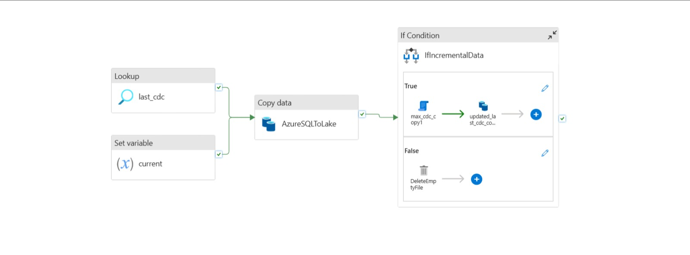
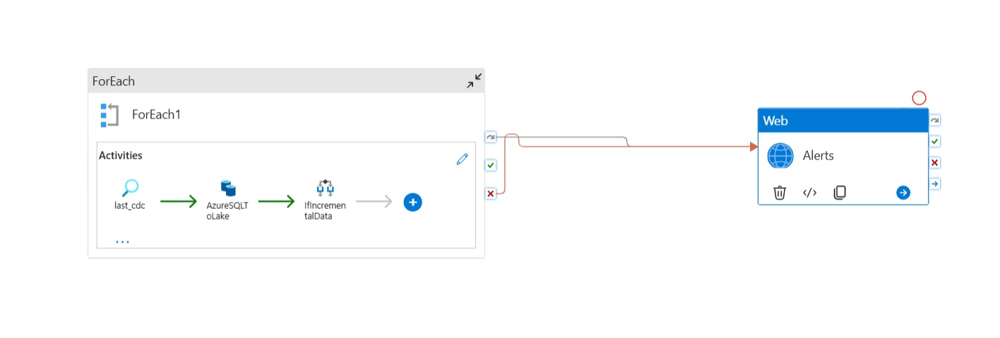

## Bronze Layer – Dynamic & Monitored Ingestion

The Bronze layer is responsible for ingesting raw data from Azure SQL into Azure Data Lake using a dynamic incremental framework.

Initially, the ingestion pipeline was designed to:

- Read the last processed watermark from `cdc.json`
- Load only new or updated records using a CDC column
- Dynamically calculate the latest `MAX(updated_at)`
- Safely update the watermark for the next run

This ensured efficient incremental loading without full data refresh.

---

### Making the Pipeline Production-Ready

In real-world systems, successful runs are not enough — pipelines must also handle failures and scale across multiple tables.

To address this, the ingestion logic was extended into a fully dynamic solution using **ForEach**.

This enabled:

- Incremental ingestion across multiple tables
- Centralized watermark management
- Conditional CDC updates
- Support for backdated refresh
- Empty file handling
- No hardcoding (fully parameterized)

The pipeline now adapts automatically based on metadata inputs.

---

### Monitoring & Alerts

A production-grade pipeline must also detect failures.

To enable observability:

- Monitoring logic was introduced
- A Web activity was integrated to trigger alerts
- Notifications are generated whenever a pipeline fails
- Alerts include pipeline name and run details

This ensures:

- Failure visibility
- Safe incremental updates
- Operational reliability

---

### Key Design Principles

- Metadata-driven execution
- Conditional watermark updates
- Reusable across multiple tables
- Clean incremental logic
- Built-in monitoring

Together, these enhancements transformed a basic ingestion process into a resilient and production-style Bronze layer.

---

### Pipelines

#### Incremental Ingestion

#### Dynamic Multi-Table Ingestion & Alerts

